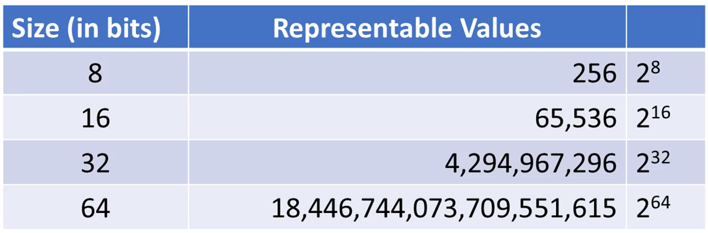
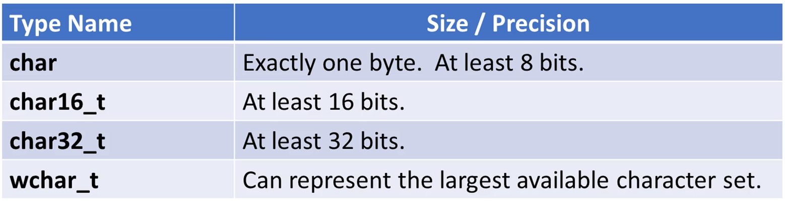
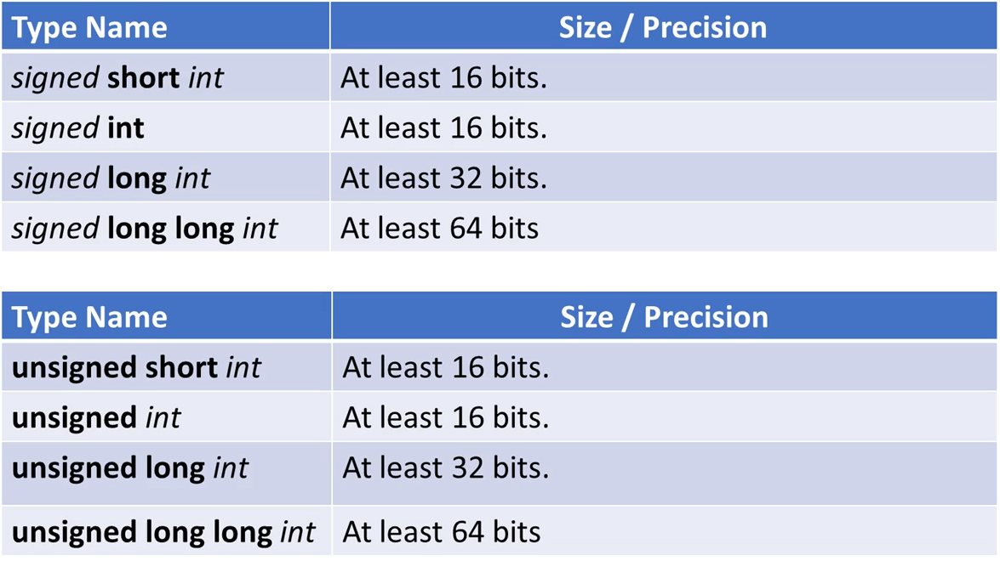
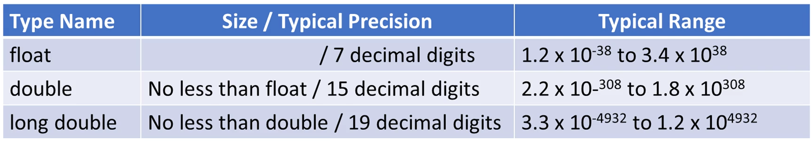
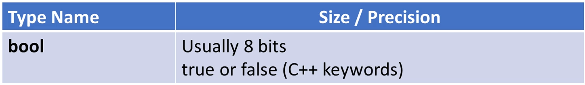

Fundamental data types  implemneted directly by yhe C++ language

Charecter types
Integer types
    signed and unsigned
Floating-point types
Boolean types
Size and precision of often compiler-dependent
    #include<climits>

Types sizes
    Expressed in bits
    The more bits the more values that can be represented
    The more bits the more storage required
        

Charecter Types
    Used to represent single charecters, "A", "X", "@"
    Wider types are used to represent wide character sets
        

Integer Types
    Used to represent whole numbers
    Signed and unsigned versions
        

Floating-point Types
    Used to represent non-integer numbers
    Resepresented by mantissa and exponent(scientific notation)
    Precision is the number of digits in the mantissa
    Precision and size are compiler dependent
        

Boolean Types
    Used to represent true and false
    Zero is false
    Non-zero is true
        ,

